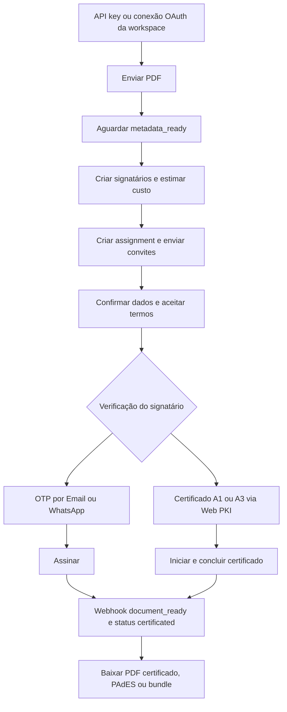

# SDK .NET da Assinafy

*Português · [Read in English](README.en.md)*

Cliente .NET tipado para a API de assinatura eletrônica da
[Assinafy](https://api.assinafy.com.br/v1/docs) — plataforma brasileira de assinatura de documentos.
Cobre toda a superfície HTTP documentada — documentos, templates, signatários, assignments, o fluxo
de assinatura do signatário, imagens de assinatura, tags, campos, webhooks, contas, usuários e o
fluxo OAuth 2.1 — como recursos fortemente tipados em um único `AssinafyClient`, com uma hierarquia
de exceções, tratamento de envelope e paginação já resolvidos.

Compatível com `net8.0`, `net9.0` e `net10.0`. **Zero dependências NuGet.**

Para aplicações novas, use **.NET 10 LTS**. A referência de cada método, com parâmetros,
corpos de requisição, respostas e erros, está em [docs/API.md](docs/API.md#sdk-method-index).

## Índice

1. [Instalação](#instalação)
2. [Credenciais e ambientes](#credenciais-e-ambientes)
3. [Criando um cliente](#criando-um-cliente)
4. [Injeção de dependência](#injeção-de-dependência)
5. [Como funcionam requisições e respostas](#como-funcionam-requisições-e-respostas)
6. [Tratamento de erros](#tratamento-de-erros)
7. [O fluxo completo de assinatura](#o-fluxo-completo-de-assinatura)
8. [OAuth 2.1 para aplicações multi-workspace](#oauth-21-para-aplicações-multi-workspace)
9. [Métodos de verificação do signatário](#métodos-de-verificação-do-signatário)
10. [Assinatura por certificado digital ICP-Brasil](#assinatura-por-certificado-digital-icp-brasil)
11. [O fluxo do signatário](#o-fluxo-do-signatário)
12. [Templates, tags e campos](#templates-tags-e-campos)
13. [Webhooks](#webhooks)
14. [Trilha de atividades e artefatos](#trilha-de-atividades-e-artefatos)
15. [Contas e usuários](#contas-e-usuários)
16. [Testes](#testes)
17. [Suporte e versionamento](#suporte-e-versionamento)
18. [Documentação](#documentação)

## Instalação

```bash
dotnet add package Assinafy.Sdk --version 2.5.0
```

Aplicações precisam de um runtime compatível com `net8.0`, `net9.0` ou `net10.0`. Quem contribui
precisa dos SDKs .NET 8.0.424, 9.0.317 e 10.0.400; o [`global.json`](global.json) seleciona o .NET 10
para os comandos do repositório.

## Credenciais e ambientes

A Assinafy aceita três credenciais:

| Credencial | Enviada como | Obtida de | Usar para |
|---|---|---|---|
| Chave de API | Header `X-Api-Key` | `Authentication.CreateApiKeyAsync` (ou o app web) | Integrações servidor-a-servidor na **sua própria** workspace |
| Token de acesso | `Authorization: Bearer …` | `Authentication.LoginAsync` / `SocialLoginAsync` | Agir como um usuário logado |
| Token OAuth | `Authorization: Bearer …` | `OAuth.ExchangeCodeAsync` | Uma aplicação agindo na workspace **de outra pessoa**, com a permissão dela |

Chave de API e token são mutuamente exclusivos — informar ambos lança `ValidationException`. Um
token OAuth é informado em `Token`, como qualquer credencial bearer. Crie um usuário **separado**
para a integração por chave de API, para que ele receba apenas o acesso necessário, e nunca comite
a chave.

Desenvolva contra o sandbox e troque uma única opção para ir a produção:

| Ambiente | URL base da API | App web |
|---|---|---|
| Sandbox | `https://sandbox.assinafy.com.br/v1` | `https://app-sandbox.assinafy.com.br` |
| Produção (padrão) | `https://api.assinafy.com.br/v1` | `https://app.assinafy.com.br` |

A maioria dos endpoints tem escopo de uma **conta** (workspace). Defina `AccountId` uma vez no
cliente e todo método com escopo de conta o utiliza; cada um desses métodos também aceita um
`accountId` opcional para sobrescrever. `Accounts.ListAsync()` descobre os IDs disponíveis para a
credencial atual.

## Criando um cliente

```csharp
using Assinafy.Sdk;
using Assinafy.Sdk.Models;

using var client = new AssinafyClient(new AssinafyClientOptions
{
    ApiKey = Environment.GetEnvironmentVariable("ASSINAFY_API_KEY"),
    AccountId = Environment.GetEnvironmentVariable("ASSINAFY_ACCOUNT_ID"),
    BaseUrl = "https://sandbox.assinafy.com.br/v1",   // omita para produção
    Timeout = TimeSpan.FromSeconds(30),               // padrão
});
```

Existem dois atalhos para os casos comuns:

```csharp
using var fromArgs = AssinafyClient.Create(apiKey, accountId);

using var fromSettings = AssinafyClient.FromConfig(new Dictionary<string, string?>
{
    ["api_key"] = configuration["Assinafy:ApiKey"],
    ["account_id"] = configuration["Assinafy:AccountId"],
});
```

`FromConfig` aceita chaves em snake_case ou camelCase (`api_key`/`apiKey`, `account_id`/`accountId`,
`token`/`access_token`/`accessToken`, `base_url`/`baseUrl`).

**Tempo de vida.** `AssinafyClient` é thread-safe e mantém um `HttpClient` com pool. Crie um por
aplicação e reutilize — criar um por requisição esgota os sockets. Faça `Dispose` apenas quando ele
for dono do próprio transporte: os construtores acima são, a sobrecarga com `HttpClient` não, deixando
o tempo de vida daquele cliente com você.

**Endurecimento do transporte.** `BaseUrl` precisa ser uma URL HTTPS absoluta cujo caminho seja
exatamente `/v1`; informação de usuário, segmentos extras, query string e fragmento são rejeitados. O
transporte próprio do SDK desativa redirecionamentos automáticos, porque o .NET repassa headers
customizados como `X-Api-Key` para o destino do redirecionamento. Se você fornecer seu próprio
`HttpClient`, o `BaseAddress` dele precisa bater com `BaseUrl` e **você** precisa desativar os
redirecionamentos no handler primário:

```csharp
using var http = new HttpClient(AssinafyClient.CreatePrimaryHandler())
{
    BaseAddress = new Uri("https://sandbox.assinafy.com.br/v1/"),   // note a barra final
};
using var client = new AssinafyClient(
    new AssinafyClientOptions
    {
        ApiKey = apiKey,
        AccountId = accountId,
        BaseUrl = "https://sandbox.assinafy.com.br/v1",
    },
    http);
```

`AssinafyClient.CreatePrimaryHandler()` devolve exatamente o handler que o SDK usa no próprio
transporte — redirecionamentos e cookies desativados, tempo de vida de conexão de cinco minutos e apenas TLS
1.2 ou 1.3, porque a Assinafy recusa protocolos anteriores no handshake (uma `NetworkException`,
nunca um status HTTP).

As credenciais são anexadas por requisição; o SDK não grava credenciais nos headers padrão.
Não configure `Authorization`, `X-Api-Key` ou cookies no transporte fornecido: seus headers
padrão também alcançam rotas públicas e do signatário. O SDK acrescenta `Accept` e `User-Agent`
quando ausentes. O `Timeout` do transporte fornecido fica intocado — defina você mesmo.

## Injeção de dependência

O pacote **não tem dependências NuGet** e não inclui adaptador de container, então ele nunca arrasta
uma versão de `Microsoft.Extensions.*` para dentro da sua aplicação. Registre-o com o container que
você já usa — o construtor com `HttpClient` é o ponto de extensão:

```csharp
builder.Services
    .AddHttpClient("Assinafy", http =>
    {
        http.BaseAddress = new Uri("https://api.assinafy.com.br/v1/");   // note a barra final
        http.Timeout = TimeSpan.FromSeconds(30);
    })
    .ConfigurePrimaryHttpMessageHandler(AssinafyClient.CreatePrimaryHandler)
    .SetHandlerLifetime(Timeout.InfiniteTimeSpan);

builder.Services.AddSingleton(serviceProvider => new AssinafyClient(
    new AssinafyClientOptions
    {
        ApiKey = builder.Configuration["Assinafy:ApiKey"],
        AccountId = builder.Configuration["Assinafy:AccountId"],
        BaseUrl = "https://api.assinafy.com.br/v1",
    },
    serviceProvider.GetRequiredService<IHttpClientFactory>().CreateClient("Assinafy")));
```

Quatro detalhes importam:

- **`ConfigurePrimaryHttpMessageHandler(AssinafyClient.CreatePrimaryHandler)`** desativa
  redirecionamentos automáticos, para que a chave de API nunca seja repassada ao destino de um
  redirecionamento. Não pule isso.
- **`SetHandlerLifetime(Timeout.InfiniteTimeSpan)`** — o singleton captura um único `HttpClient` e
  por isso não enxerga a rotação de handlers da factory. `CreatePrimaryHandler` recicla conexões via
  `PooledConnectionLifetime`, que é o que mantém mudanças de DNS visíveis.
- **`BaseAddress` precisa bater com `BaseUrl`**, com barra final na `Uri`.
- **Defina o `Timeout` no `HttpClient`.** `AssinafyClientOptions.Timeout` é ignorado para um cliente
  fornecido, porque o SDK não altera um transporte que não é dele.

Políticas de resiliência encadeiam normalmente no `IHttpClientBuilder`. Limite as retentativas aos
métodos seguros: o handler padrão repete qualquer método, e repetir um `POST` pode, por exemplo,
enviar o mesmo documento duas vezes:

```csharp
using Microsoft.Extensions.Http.Resilience;   // 9.8+: versões anteriores ainda repetem timeouts

builder.Services
    .AddHttpClient("Assinafy", http =>
    {
        http.BaseAddress = new Uri("https://api.assinafy.com.br/v1/");
        http.Timeout = TimeSpan.FromSeconds(30);
    })
    .ConfigurePrimaryHttpMessageHandler(AssinafyClient.CreatePrimaryHandler)
    .AddStandardResilienceHandler(options => options.Retry.DisableForUnsafeHttpMethods());
```

Não faça `Dispose` do cliente resolvido: o `IHttpClientFactory` é dono do transporte.

**Mantenha as chamadas de token e de revogação do OAuth fora da factory.** Reenviar um
`POST /oauth/token` reapresenta um código de uso único ou um refresh token que talvez já tenha
rotacionado, o que desconecta o usuário, e configurar os handlers que você adiciona não elimina esse
risco: um handler de retentativa ou de hedging registrado com `ConfigureHttpClientDefaults` vale
para todo cliente que a factory cria, inclusive um cliente nomeado à parte; um handler de hedging
(`AddStandardHedgingHandler`) envia cópias em paralelo por definição; e o
`Microsoft.Extensions.Http.Resilience` anterior à 9.8 repetia timeouts mesmo com
`DisableForUnsafeHttpMethods`. Um cliente construído sem `HttpClient` é dono de um transporte que a
factory nunca toca — `CreatePrimaryHandler()` e nenhum outro handler —, então registre um para
`ExchangeCodeAsync`, `RefreshTokenAsync` e `RevokeAsync`:

```csharp
builder.Services.AddKeyedSingleton("AssinafyOAuth", (_, _) =>
    new AssinafyClient(new AssinafyClientOptions()));   // sem credencial própria
```

Injete-o como `[FromKeyedServices("AssinafyOAuth")] AssinafyClient oauth`.

## Como funcionam requisições e respostas

**O envelope.** Toda resposta da Assinafy é `{ status, message, data }`. O SDK desembrulha: o método
devolve o payload de `data`, já tipado. Um `status` 400 ou maior vira `ApiException`
independentemente da linha de status HTTP, então um "200 OK" carregando um envelope de erro ainda
lança. As rotas OAuth são a exceção deliberada — elas seguem os contratos da RFC 6749 e do OpenID
Connect, em JSON plano, e o SDK trata isso automaticamente.

**Nomenclatura.** Corpos de requisição e resposta usam `snake_case`, resolvido para você. A única
exceção é o corpo de assinatura do signatário, que a API define em camelCase;
`SignAssignmentValue` aplica isso sozinho.

**Listas.** Existem duas formas, e o tipo de retorno diz qual:

- `IReadOnlyList<T>` — o endpoint devolve o array completo (tags, atividades, estatísticas, tipos de
  evento, tipos de campo, status).
- `PaginatedResult<T>` — o endpoint pagina. `Data` traz a página; `Meta` traz `CurrentPage`,
  `PerPage`, `Total` e `LastPage`, lidos dos headers `X-Pagination-*`. `Meta` é `null` quando a
  resposta não trouxe esses headers.

Os parâmetros de paginação são `page` (base 1) e `per-page` (máximo 100), junto de `search` e `sort`
onde o endpoint suportar:

```csharp
var filtros = new Dictionary<string, string?>
{
    ["status"] = "pending_signature",
    ["sort"] = "-created_at",
    ["page"] = "1",
    ["per-page"] = "50",
};
var pagina = await client.Documents.ListAsync(filtros);

Console.WriteLine($"{pagina.Data.Count} de {pagina.Meta?.Total} documentos");

while (pagina.Meta is { CurrentPage: int atual, LastPage: int ultima } && atual < ultima)
{
    filtros["page"] = (atual + 1).ToString();
    pagina = await client.Documents.ListAsync(filtros);
    // …processe pagina.Data
}
```

**Cancelamento e timeouts.** Todo método recebe um `CancellationToken` final. Um timeout do lado do
cliente vira `NetworkException`; um token que você cancelou propaga como `OperationCanceledException`,
inalterado.

**Limite de requisições.** A API devolve `429` quando o chamador excede a cota. O SDK não repete
automaticamente — trate, aguarde e repita, ou encadeie um handler de resiliência.
`Documents.WaitUntilReadyAsync` é a exceção: ele trata `404`, `429` e `5xx` como transitórios
enquanto faz polling.

## Tratamento de erros

Toda exceção específica do SDK deriva de `AssinafyException`:

| Exceção | Lançada quando | Membros principais |
|---|---|---|
| `ValidationException` | O SDK rejeita a entrada antes de qualquer chamada HTTP | `Details` (por campo) |
| `ApiException` | A API devolveu status ou envelope de erro | `StatusCode`, `ApiMessage`, `Details` |
| `OAuthException` | A falha traz um código de erro OAuth legível por máquina, vindo de uma rota OAuth ou de um desafio `insufficient_scope` em qualquer rota. Deriva de `ApiException` | `Error`, `ErrorDescription`, `Scope` |
| `NetworkException` | Falha de conexão, DNS ou TLS, ou timeout do lado do cliente | `InnerException` |
| `SerializationException` | Um corpo não pôde ser serializado, ou a resposta de sucesso não bateu com o envelope ou payload esperado | `InnerException` |

Exceções padrão de argumento, cancelamento, descarte e stream mantêm seus tipos da plataforma.

```csharp
try
{
    await client.Documents.GetAsync(documentId);
}
catch (ApiException ex) when (ex.StatusCode == 404)
{
    Console.WriteLine($"Não encontrado: {ex.ApiMessage}");
}
catch (ApiException ex) when (ex.StatusCode == 429)
{
    // Aguarde e repita.
}
catch (ApiException ex)
{
    Console.WriteLine($"{ex.StatusCode}: {ex.ApiMessage}");
    Console.WriteLine(ex.Details?.GetRawText());   // erros por campo, quando houver
}
catch (NetworkException ex)
{
    Console.WriteLine($"Falha de transporte: {ex.Message}");
}
```

## O fluxo completo de assinatura

Uma solicitação de assinatura passa por cinco etapas. Todo o resto do SDK serve a uma delas.



1. **Envie** um PDF para uma workspace, criando um documento em status `uploaded`.
2. **Aguarde** a plataforma normalizar o arquivo e extrair as páginas (`metadata_ready`).
3. **Crie os signatários** — registros de pessoas reutilizáveis, pertencentes à workspace.
4. **Crie o assignment**, ligando os signatários ao documento. É isso que dispara os convites.
5. **Os signatários assinam**; quando o último termina, o documento vira `certificated` e os
   artefatos assinados ficam disponíveis para download.

De ponta a ponta:

```csharp
using Assinafy.Sdk;
using Assinafy.Sdk.Models;

using var client = new AssinafyClient(new AssinafyClientOptions
{
    ApiKey = Environment.GetEnvironmentVariable("ASSINAFY_API_KEY"),
    AccountId = Environment.GetEnvironmentVariable("ASSINAFY_ACCOUNT_ID"),
});

// 1–2. Envie o PDF e aguarde o documento ficar pronto.
await using var pdf = File.OpenRead("contrato.pdf");
var documento = await client.Documents.UploadAsync(pdf, "contrato.pdf");
documento = await client.Documents.WaitUntilReadyAsync(documento.Id);

// 3. Crie o signatário.
var signatario = await client.Signers.CreateAsync(new CreateSignerRequest
{
    FullName = "João da Silva",
    Email = "joao@example.com",
});

// 4. Confira o custo antes de comprometer créditos.
var pedido = new CreateAssignmentRequest
{
    Method = AssignmentMethods.Virtual,
    Message = "Por favor, revise e assine.",
    Signers =
    [
        new SignerRef
        {
            Id = signatario.Id,
            VerificationMethod = SignerChannels.Email,
            NotificationMethods = [SignerChannels.Email],
        },
    ],
};

var estimativa = await client.Assignments.EstimateCostAsync(documento.Id, pedido);
if (!estimativa.HasSufficientResources)
    throw new InvalidOperationException(estimativa.BlockingReason);

// 5. Solicite a assinatura. É esta chamada que envia o convite.
var assignment = await client.Assignments.CreateAsync(documento.Id, pedido);

// assignment.SigningUrls traz um link por signatário, se você preferir entregá-lo você mesmo.

// 6. Aguarde a conclusão e baixe o PDF certificado.
using var prazo = new CancellationTokenSource(TimeSpan.FromHours(1));
DocumentDetails concluido;
do
{
    await Task.Delay(TimeSpan.FromSeconds(10), prazo.Token);
    concluido = await client.Documents.GetAsync(documento.Id, prazo.Token);
}
while (!string.Equals(concluido.Status, "certificated", StringComparison.OrdinalIgnoreCase));

var certificado = await client.Documents.DownloadAsync(documento.Id);
await File.WriteAllBytesAsync("contrato-assinado.pdf", certificado);
```

O polling aparece aqui por clareza. Em produção, assine o webhook `document_ready`
[em vez de fazer polling](#webhooks).

As etapas 1 a 5 colapsam em uma única chamada quando você não precisa inspecionar os resultados
intermediários:

```csharp
await using var pdf = File.OpenRead("contrato.pdf");
var resultado = await client.UploadAndRequestSignaturesAsync(new UploadAndRequestSignaturesOptions
{
    FileStream = pdf,
    FileName = "contrato.pdf",
    Message = "Por favor, revise e assine.",
    Signers =
    [
        new UploadAndRequestSignaturesSigner
        {
            FullName = "João da Silva",
            Email = "joao@example.com",
            VerificationMethod = SignerChannels.Email,
            NotificationMethods = [SignerChannels.Email],
        },
    ],
});

// resultado.Document, resultado.Assignment, resultado.SignerIds
```

O auxiliar **não** é transacional de propósito, porque a API não tem transação abrangendo envio,
criação de signatários e criação do assignment. Se uma chamada posterior falhar, os recursos já
criados permanecem para você inspecionar ou limpar.

### Os dois métodos de assignment

| Método | O que faz | Exige |
|---|---|---|
| `AssignmentMethods.Virtual` | Os signatários são notificados e assinam remotamente, quando quiserem | Documento em `uploaded`, `metadata_processing` ou `metadata_ready` |
| `AssignmentMethods.Collect` | Valores de campos são coletados em sessão, em posições explícitas de página e campo | Documento em `metadata_ready`, mais `Entries` |

Um assignment `collect` precisa de uma entrada por página descrevendo qual signatário preenche qual
campo:

```csharp
var collect = await client.Assignments.CreateAsync(documento.Id, new CreateAssignmentRequest
{
    Method = AssignmentMethods.Collect,
    Signers = [new SignerRef { Id = signatario.Id }],
    Entries =
    [
        new AssignmentEntry
        {
            PageId = documento.Pages[0].Id,
            Fields =
            [
                new AssignmentEntryField
                {
                    SignerId = signatario.Id,
                    FieldId = fieldId,
                    DisplaySettings = new DisplaySettings
                    {
                        Left = 100, Top = 640, Width = 220, Height = 40, FontSize = 12,
                    },
                },
            ],
        },
    ],
});
```

Quando os signatários ainda não existem, `UploadAndRequestSignaturesAsync` expõe `EntriesFactory`,
que roda depois da criação dos signatários e recebe os novos IDs:

```csharp
EntriesFactory = signerIds =>
[
    new AssignmentEntry
    {
        PageId = pageId,
        Fields = [new AssignmentEntryField { SignerId = signerIds[0], FieldId = fieldId }],
    },
],
```

### Assinatura em etapas

Defina `Step` por signatário para assinatura sequencial. Signatários que compartilham um passo
assinam em paralelo; o passo seguinte só é ativado — e só então notificado — quando todos do passo
anterior terminam. Omita `Step` para notificar todo mundo de uma vez.

### Prevendo o custo

Assignments consomem documentos do plano e créditos de notificação. Toda chamada que compromete
recursos tem uma estimativa equivalente que não cobra nada:
`Assignments.EstimateCostAsync`, `Documents.EstimateCostFromTemplateAsync` e
`Assignments.EstimateResendCostAsync`.

## OAuth 2.1 para aplicações multi-workspace

Use OAuth quando **outras pessoas** conectam sua aplicação à **própria** workspace delas, para que
você nunca manipule a senha nem a chave de API dessas pessoas. Para automatizar a sua própria
workspace, nada disso é necessário — continue com a chave de API.

| | Chave de API | OAuth |
|---|---|---|
| Age sobre | Sua própria workspace | A de outra pessoa, com a permissão dela |
| Pode fazer | Tudo o que sua conta pode | Só os escopos que o usuário aprovou |
| O usuário pode desligar | Não | Sim, a qualquer momento |

O fluxo usa dois hosts de propósito: a tela de aprovação pertence ao servidor de autorização
(`https://auth.assinafy.com.br`), enquanto toda chamada que seu código faz — inclusive a troca do
código por tokens — pertence a esta API. Registre a aplicação em **Integrações → Apps OAuth** no app da Assinafy; as URIs de redirecionamento precisam ser `https://` e são comparadas
caractere a caractere, então `…/callback` e `…/callback/` são URIs diferentes.

### 1. Inicie a conexão

PKCE é obrigatório para toda aplicação, inclusive as confidenciais. Gere um par novo por tentativa
e guarde os dois valores na sessão do usuário:

```csharp
using Assinafy.Sdk.Models;
using Assinafy.Sdk.Resources;

var pkce = OAuthResource.CreatePkcePair();     // verificador de 256 bits + o desafio S256
var state = OAuthResource.CreateState();       // proteção contra CSRF

HttpContext.Session.SetString("assinafy_verifier", pkce.CodeVerifier);
HttpContext.Session.SetString("assinafy_state", state);

var urlDeAutorizacao = OAuthResource.BuildAuthorizationUrl(new OAuthAuthorizationRequest
{
    ClientId = clientId,
    RedirectUri = "https://meuapp.example.com/oauth/callback",
    Scopes =
    [
        OAuthScopes.DocumentsRead,
        OAuthScopes.DocumentsWrite,
        OAuthScopes.OfflineAccess,      // peça isso para receber um refresh token
    ],
    State = state,
    CodeChallenge = pkce.CodeChallenge,
});

return Redirect(urlDeAutorizacao.ToString());   // navegação de página inteira, nunca AJAX
```

### 2. Trate o retorno e troque o código

O usuário volta com `?code=…&state=…&iss=…`, ou `?error=access_denied&…` se recusar. Valide `state`
e `iss` **antes de qualquer outra coisa** — se um dos dois divergir, a resposta não é sua. O código
é de uso único e expira 60 segundos após a aprovação, então troque-o pelo servidor imediatamente:

```csharp
if (state is null ||
    state != HttpContext.Session.GetString("assinafy_state") ||
    iss != OAuthResource.DefaultIssuer)
    return BadRequest();

var verifier = HttpContext.Session.GetString("assinafy_verifier");
HttpContext.Session.Remove("assinafy_state");
HttpContext.Session.Remove("assinafy_verifier");

if (error is not null)          // access_denied, invalid_scope, invalid_request, …
    return View("FalhaNaConexao", error);

var tokens = await oauth.OAuth.ExchangeCodeAsync(new OAuthCodeExchangeRequest
{
    Code = code,
    RedirectUri = "https://meuapp.example.com/oauth/callback",
    CodeVerifier = verifier!,
    ClientId = clientId,
    ClientSecret = clientSecret,    // omita por completo em aplicação pública
});
```

`oauth` é um cliente que sua aplicação cria uma única vez, como
`new AssinafyClient(new AssinafyClientOptions())`, e usa só nas chamadas de token e de revogação.
Ele não precisa de credencial, porque essas rotas se autenticam com as credenciais da própria
aplicação, e é dono do próprio transporte, então nenhum handler de retentativa ou de hedging
consegue reenviar um código de uso único ou um refresh token (veja
[Injeção de dependência](#injeção-de-dependência)). Leia `tokens.Scope` em vez de supor que tudo
foi concedido:

```csharp
if (!tokens.HasScope(OAuthScopes.DocumentsWrite))
    return View("ReconectarComPermissaoDeEscrita");
```

### 3. Descubra a workspace e chame a API

Um token pertence a **uma única** workspace, a que o usuário escolheu. Com um token OAuth, a lista
de workspaces devolve exatamente ela — guarde o ID junto dos tokens:

```csharp
using var client = new AssinafyClient(new AssinafyClientOptions { Token = tokens.AccessToken });

var contas = await client.Accounts.ListAsync();
var accountId = contas[0].Id;                   // a workspace que o usuário conectou

var documentos = await client.Documents.ListAsync(accountId: accountId);
```

Chamar qualquer outra workspace devolve `403`, mesmo outra à qual o mesmo usuário pertença. Se o
cliente usa várias workspaces, conecte cada uma separadamente e guarde tokens por workspace.

### 4. Renove e trate escopo faltante

O token de acesso dura uma hora. Com `offline_access` você renova sem o usuário: quando uma chamada
responder `401`, renove uma vez e repita a chamada com um cliente construído com o novo token de
acesso, porque um cliente guarda o token com que foi construído:

```csharp
var enviado = await CarregarRefreshTokenAsync(conexaoId);   // sob o lock de renovação da conexão

var renovado = await oauth.OAuth.RefreshTokenAsync(new OAuthRefreshRequest
{
    RefreshToken = enviado,
    ClientId = clientId,
    ClientSecret = clientSecret,
});

await SalvarTokensAsync(conexaoId, renovado);   // faça isso PRIMEIRO: refresh tokens rotacionam

using var client = new AssinafyClient(new AssinafyClientOptions { Token = renovado.AccessToken });
```

> **Usar um refresh token aposentado desconecta o usuário.** Cada renovação devolve um refresh token
> novo e invalida o anterior; `RefreshTokenAsync` lança `SerializationException` quando a resposta
> não traz um novo. Um token reapresentado não se distingue de um roubado, então isso encerra a
> conexão inteira. Persista o token novo antes de qualquer outra coisa, renove um de cada vez por
> conexão e nunca reenvie um refresh token automaticamente, nem pelo seu código nem por um handler
> de retentativa. Um refresh token vale 30 dias e cada renovação devolve um novo, com mais 30 dias,
> então a conexão só expira se sua aplicação passar 30 dias sem renovar; depois disso, o usuário
> precisa conectar de novo.

**Se uma renovação falhar**, o servidor pode ter rotacionado o token mesmo assim: um timeout ou uma
resposta perdida parece igual a uma requisição que nunca chegou. Releia o token guardado e siga em
frente só se outro worker tiver salvo um token *diferente*. Se ainda for o token que você enviou,
nunca o envie de novo: trate a conexão como incerta e peça ao usuário que conecte de novo. Só é
seguro repetir falhas que comprovadamente aconteceram antes do envio — resolução de DNS, conexão
recusada ou handshake TLS, que aparecem como uma `NetworkException` cuja `HttpRequestException`
interna tem `HttpRequestError` igual a `NameResolutionError`, `ConnectionError` ou
`SecureConnectionError`.

Chamar um endpoint para o qual o token nunca recebeu permissão devolve `403` com um desafio nomeando
o escopo. O SDK expõe isso em **todos** os endpoints, não só nos de OAuth:

```csharp
try
{
    await client.Documents.UploadAsync(pdf, "contrato.pdf", accountId);
}
catch (OAuthException ex) when (ex.Error == "insufficient_scope")
{
    // Reconecte pedindo ex.Scope — não repita, a resposta não vai mudar.
    return Redirect(MontarUrlDeReconexao(ex.Scope));
}
catch (OAuthException ex) when (ex.Error == "invalid_grant")
{
    // A concessão expirou, ou o usuário reconectou com permissões diferentes.
    return Redirect(MontarUrlDeReconexao(null));
}
```

### 5. Desconecte

Quando o usuário desconecta no seu produto, revogue o token em vez de apenas apagar sua cópia.
Revogar o refresh token encerra a conexão inteira, e a rota responde `200` seja qual for o estado do
token, inclusive um que uma renovação já aposentou, então uma cópia desatualizada não dá sinal de
que a conexão terminou ou não. Leia o token do armazenamento imediatamente antes da chamada, sob o
mesmo lock por conexão usado na renovação:

```csharp
var atual = await CarregarRefreshTokenAsync(conexaoId);   // sob o lock de renovação da conexão

await oauth.OAuth.RevokeAsync(new OAuthRevokeRequest
{
    Token = atual,
    ClientId = clientId,
    ClientSecret = clientSecret,
    TokenTypeHint = "refresh_token",
});
```

### Escopos

| Constante em `OAuthScopes` | Valor | Permite à sua aplicação |
|---|---|---|
| `DocumentsRead` | `documents:read` | Ler documentos, signatários, assignments, atividades, notificações WhatsApp e tipos/histórico de webhooks |
| `DocumentsWrite` | `documents:write` | Criar documentos e enviá-los para assinatura |
| `TemplatesRead` | `templates:read` | Ler templates |
| `TemplatesWrite` | `templates:write` | Criar e alterar templates |
| `AccountRead` | `account:read` | Ler perfil, tema, logo e assinatura de webhook da workspace |
| `WebhooksWrite` | `webhooks:write` | Configurar e desativar a assinatura de webhooks da workspace |
| `OpenId` | `openid` | Receber um `id_token` identificando o usuário |
| `Profile` | `profile` | Ler o nome do usuário |
| `Email` | `email` | Ler o e-mail do usuário e se ele é verificado |
| `OfflineAccess` | `offline_access` | Receber um refresh token |

Peça o mínimo: o usuário aprova tudo ou nada, e `documents:write` pode gastar créditos de
notificação da workspace. Faturamento, composição da workspace, credenciais e administração nunca
são acessíveis a um token OAuth, sejam quais forem os escopos.

### OpenID Connect e descoberta

Peça `openid` (mais `profile` e/ou `email`) para receber um `id_token` assinado, e leia as claims
pelo endpoint de userinfo:

```csharp
var quem = await client.OAuth.GetUserInfoAsync();
Console.WriteLine($"{quem.Sub} · {quem.Name} · {quem.Email} (verificado: {quem.EmailVerified})");
```

Valide o `id_token` com qualquer biblioteca OpenID Connect: `RS256`, chaves em
`https://auth.assinafy.com.br/.well-known/jwks.json` escolhidas pelo `kid`, `iss` igual a
`OAuthResource.DefaultIssuer`, `aud` igual ao seu `client_id`, `exp` no futuro e `nonce` igual ao
que você enviou, se enviou.

Em vez de fixar endpoints no código, descubra-os:

```csharp
var metadados = await client.OAuth.GetProtectedResourceMetadataAsync();
// metadados.AuthorizationServers[0] → busque o /.well-known/oauth-authorization-server dele
```

### Erros do fluxo OAuth

| `Error` | Causa comum | O que fazer |
|---|---|---|
| `invalid_grant` | Código expirado ou já usado; `code_verifier` ou `redirect_uri` errado; refresh token gasto, ou o usuário reconectou com outras permissões | Refaça o fluxo com o usuário |
| `invalid_client` | `client_id` ou segredo errado, ou aplicação desabilitada | Corrija a configuração |
| `invalid_target` | `resource` diverge do valor autorizado | Envie o mesmo `Resource` nos dois endpoints |
| `unsupported_grant_type` | Grant desconhecido; apps comuns usam `authorization_code` ou `refresh_token` | Corrija a chamada |
| `insufficient_scope` | Um `403` em endpoint comum; falta ao token a permissão em `Scope` | Reconecte pedindo aquele escopo |

Aplicações novas não são verificadas: a tela de aprovação avisa isso e elas conectam a no máximo 25
workspaces. As rotas de autorização e token aceitam 50 requisições por minuto por IP.

### Troca de token para serviços internos

`OAuth.ExchangeSubjectTokenAsync` implementa o grant RFC 8693 documentado pela API para
clientes confidenciais de serviço interno provisionados pela Assinafy. Aplicações comuns de
marketplace, públicas ou confidenciais, recebem `invalid_client` nesse grant e usam o fluxo
PKCE acima. A troca recebe `OAuthTokenExchangeRequest` e devolve `OAuthTokenResult`, incluindo
`IssuedTokenType`, sem refresh token; o token emitido mantém a identidade do cliente original.
Payloads completos estão em [docs/API.md](docs/API.md#post-v1oauthtoken).

## Métodos de verificação do signatário

Definidos por signatário ao criar o assignment. Informe exatamente um canal em
`NotificationMethods`: `Email` ou `Whatsapp`. Verificação e notificação são acopladas; se apenas
um lado for informado, a API infere o outro. Sem nenhum dos dois, ambos assumem `Email`.
Verificação `Email` exige notificação `Email`; `Whatsapp` exige `Whatsapp`; `DigitalCertificate`
permite qualquer um desses dois canais. Dois canais ou uma combinação incompatível retornam `400`.

| Método | Como funciona | Custo por signatário |
| --- | --- | --- |
| `Email` *(padrão)* | Código de uso único (OTP) por e-mail, exigido antes de assinar | 0 créditos |
| `Whatsapp` | Código de uso único (OTP) por WhatsApp | 0,45 crédito (a notificação WhatsApp, que este método exige); só em planos pagos |
| `DigitalCertificate` | O signatário assina com o **próprio certificado ICP-Brasil (A1/A3)**, pela extensão de navegador Web PKI, gerando uma assinatura **PAdES qualificada** | 0,5 crédito + a notificação |

O que é cobrado é a **notificação** — nenhum método de verificação tem preço próprio, exceto o
certificado digital, que cobra a assinatura em si. Como os lados são acoplados, escolher verificação
por `Whatsapp` escolhe junto a notificação por WhatsApp e o custo dela.

`DigitalCertificate` é exclusivo de verificação; use `Email` ou `Whatsapp` para notificar.
Os destinatários precisam dos dados de contato dos canais escolhidos, e WhatsApp exige plano pago.
Use `Assignments.EstimateCostAsync` para obter o custo e os bloqueios da configuração enviada.

## Assinatura por certificado digital ICP-Brasil

Exige o recurso **Certificado Digital** na conta (planos Standard e Pro), CPF ou CNPJ em
`GovernmentId` do signatário, e exatamente **um signatário por certificado naquele passo**. Um CPF
exige o certificado daquela pessoa (e-CPF, ou e-CNPJ que a nomeie como representante legal); um CNPJ
exige um e-CNPJ da empresa.

Quando o método de verificação do assignment é `DigitalCertificate`, assinar é um handshake de dois
passos com a extensão Web PKI, e não o envio de campos:

```csharp
// Confirme identidade e termos antes de Signing.GetAsync para certificados.
await client.Signers.ConfirmDataAsync(documentId, signerAccessCode, new ConfirmSignerDataRequest
{
    FullName = "João da Silva",
    GovernmentId = governmentId,   // CPF/CNPJ correspondente ao certificado do signatário
    HasAcceptedTerms = true,
});
var paraAssinarComCertificado = await client.Signing.GetAsync(signerAccessCode);
var operacao = await client.Signing.StartCertificateAsync(signerAccessCode);
// Envie operacao.Token ao navegador para assinatura pela extensão Web PKI.
```

Depois que seu navegador devolver `tokenAssinado`, conclua a operação:

```csharp
var resultado = await client.Signing.CompleteCertificateAsync(signerAccessCode, tokenAssinado);
Console.WriteLine(resultado.SignerName);
```

> Ambas as rotas são extensões implantadas **somente em produção**: o sandbox não as expõe e elas não
> constam do documento OpenAPI publicado. Exigem um assignment de certificado real em produção e um
> token Web PKI assinado pelo navegador.

Concluído o fluxo, baixar o artefato `pades` devolve a assinatura PAdES qualificada.
`Signing.GetAsync` devolve `400` para certificados antes da confirmação de dados e aceite dos
termos; seu parâmetro `hasAcceptedTerms` não substitui essa preparação.

## O fluxo do signatário

Estes endpoints pertencem a quem assina, não à sua workspace. Eles se autenticam com o **código de
acesso do signatário** presente no link de assinatura, e o SDK deliberadamente **não** anexa a eles
sua chave de API nem seu token.

Implemente-os quando você hospedar a experiência de assinatura; ignore a seção inteira se deixar a
Assinafy notificar os signatários e hospedar a página.

```csharp
// Carregue tudo o que o signatário precisa.
var paraAssinar = await client.Signing.GetAsync(signerAccessCode);
var perfil = await client.Signers.GetSelfAsync(signerAccessCode);

// Registre o aceite dos termos.
await client.Signers.AcceptTermsAsync(signerAccessCode);

// Valide o código de uso único entregue por e-mail ou WhatsApp.
await client.Signers.VerifyAsync(signerAccessCode, codigoDeVerificacao);

// Assignments virtuais exigem dados confirmados antes de assinar; senão a API devolve 400.
await client.Signers.ConfirmDataAsync(documentId, signerAccessCode, new ConfirmSignerDataRequest
{
    FullName = "João da Silva",
    Email = "joao@example.com",
    GovernmentId = "00000000000",
});

// Em collect, use um item de paraAssinar.Assignment.Items.
var item = paraAssinar.Assignment!.Items[0];
await client.Signing.SignAsync(documentId, assignmentId, signerAccessCode,
[
    new SignAssignmentValue
    {
        ItemId = item.Id,
        FieldId = item.Field!.Id,
        PageId = item.Page!.Id,
        Value = "João da Silva",
    },
]);

// Em virtual, não há campos: envie uma lista vazia após confirmar os dados.
// await client.Signing.SignAsync(documentId, assignmentId, signerAccessCode, []);

// Ou recuse, com um motivo.
await client.Signing.DeclineAsync(documentId, assignmentId, signerAccessCode, "Contraparte errada");
```

Um signatário com vários documentos pendentes pode agir em lote, navegar pelos próprios documentos e
baixar artefatos concluídos:

```csharp
await client.Signing.SignMultipleAsync(signerAccessCode, [documentId1, documentId2]);
await client.Signing.DeclineMultipleAsync(signerAccessCode, [documentId3], "Não se aplica");

var atual = await client.Signing.GetCurrentDocumentAsync(signerId, signerAccessCode);
var meus  = await client.Signing.ListDocumentsAsync(signerId, signerAccessCode,
                new SignerDocumentListParams { PerPage = 25 });

var artefato = await client.Signing.DownloadPublicAsync(
    signerId, documentId, DocumentArtifactNames.Certificated);
```

## Templates, tags e campos

**Templates** são PDFs reutilizáveis com papéis e posições de campo já definidos. Criar um documento
a partir de um template liga signatários a esses papéis em uma única chamada:

```csharp
var template = await client.Templates.GetAsync(templateId);

var doc = await client.Documents.CreateFromTemplateAsync(templateId,
[
    new TemplateSigner
    {
        RoleId = template.Roles[0].Id,   // o papel definido no template
        Id = signatario.Id,              // um signatário já existente na workspace
        VerificationMethod = SignerChannels.Email,
    },
]);
```

`TemplateSigner` liga um signatário **existente** a um papel do template, então crie o signatário
com `Signers.CreateAsync` antes. `Documents.EstimateCostFromTemplateAsync` prevê o custo da mesma
chamada sem cobrar nada.

**Tags** são rótulos da workspace, únicos por nome (sem diferenciar maiúsculas), anexáveis a
documentos:

```csharp
var tag = await client.Tags.CreateAsync(new CreateTagRequest { Name = "Contratos", Color = "#2E7D32" });
await client.Tags.AddToDocumentAsync(documentId, [tag.Id]);
await client.Tags.SetForDocumentAsync(documentId, [tag.Id]);   // substitui o conjunto inteiro
await client.Tags.RemoveFromDocumentAsync(documentId, tag.Id);
```

**Campos** são definições reutilizáveis de entrada usadas por assignments `collect` e por templates,
com validação do lado do servidor:

```csharp
var tipos = await client.Fields.ListTypesAsync();
var campo = await client.Fields.CreateAsync(new CreateFieldDefinitionRequest { Name = "CPF", Type = "cpf" });
var ok = await client.Fields.ValidateAsync(campo.Id,
    new ValidateFieldValueRequest { Value = "000.000.000-00" });
```

## Webhooks

Uma conta cadastra um endpoint de webhook, ou até três nos planos pagos. Todo endpoint ativo inscrito
em um evento o recebe, de forma independente dos demais. Prefira webhooks ao polling.

```csharp
var tipos = await client.Webhooks.ListEventTypesAsync();

var endpoint = await client.Webhooks.CreateEndpointAsync(new CreateWebhookEndpointRequest
{
    Name = "ERP",
    Url = "https://example.com/webhooks/assinafy",
    Email = "ops@example.com",
    Events = ["document_ready", "signer_signed_document", "signer_rejected_document"],
    SigningEnabled = true,
});

// Guarde o segredo junto da configuração do receptor. Indisponível para aplicações OAuth.
var segredo = await client.Webhooks.GetEndpointSecretAsync(endpoint.Id);

var endpoints = await client.Webhooks.ListEndpointsAsync();          // do mais antigo ao mais novo
await client.Webhooks.UpdateEndpointAsync(endpoint.Id, new UpdateWebhookEndpointRequest
{
    Events = ["document_ready"],                                      // só os campos enviados mudam
});

// A rotação vale na hora: as entregas passam a ser assinadas só com o novo segredo.
var novo = await client.Webhooks.RotateEndpointSecretAsync(endpoint.Id);

// Histórico de entregas (opcionalmente de um endpoint) e reenvio ao endpoint daquela entrada.
var historico = await client.Webhooks.ListDispatchesAsync(new ListDispatchesParams
{
    EndpointId = endpoint.Id,
    Delivered = false,
    From = DateTimeOffset.UtcNow.AddDays(-7).ToUnixTimeSeconds(),
    PerPage = 50,
});

foreach (var falha in historico.Data)
    await client.Webhooks.RetryDispatchAsync(falha.Id);

await client.Webhooks.DeleteEndpointAsync(endpoint.Id);               // libera a vaga
```

Criar um endpoint além do limite do plano retorna 403, e cada endpoint precisa de uma URL distinta
(400). `GetAsync`, `UpdateSubscriptionAsync` e `InactivateAsync` atuam sobre o endpoint mais antigo
da conta; `UpdateSubscriptionAsync` o cria quando a conta não tem nenhum.

### Recebendo e verificando entregas

Cada entrega é um `POST` com os cabeçalhos `webhook-id`, `webhook-timestamp` e — com assinatura
habilitada — `webhook-signature`, no padrão [Standard Webhooks](https://www.standardwebhooks.com).
Verifique a assinatura sobre o corpo **bruto** e então desserialize-o em `WebhookEvent`:

```csharp
using Assinafy.Sdk.Models;
using Assinafy.Sdk.Webhooks;
using System.Text.Json;

app.MapPost("/webhooks/assinafy", async (HttpRequest request) =>
{
    using var reader = new StreamReader(request.Body);
    var corpo = await reader.ReadToEndAsync();

    if (!WebhookSignature.Verify(
            segredoDoWebhook,                                // "whsec_…" de GetEndpointSecretAsync
            request.Headers["webhook-id"],
            request.Headers["webhook-timestamp"],
            request.Headers["webhook-signature"],
            corpo))
        return Results.Unauthorized();

    var evento = JsonSerializer.Deserialize<WebhookEvent>(corpo)!;
    // Deduplique pelo cabeçalho webhook-id; ele se repete em toda tentativa ao mesmo endpoint.
    if (evento.Event == "document_ready")
    {
        var documentId = evento.Object.GetProperty("id").GetString();
        // baixe o artefato certificado…
    }

    return Results.Ok();
});
```

`Verify` compara em tempo constante, aceita qualquer uma de várias assinaturas `v1,` separadas por
espaço e rejeita timestamps a mais de cinco minutos do relógio local (ajuste com `tolerance`). O corpo
é `{ id, event, message, payload, origin, created_at, subject, object, account_id }`, não o envelope
REST. `subject` e `object` são polimórficos — leia a propriedade `type` — e trazem timestamps em
segundos Unix. Responda `2xx` rápido: cada evento tem até duas tentativas, com três segundos de
intervalo, e dez eventos seguidos com falha pausam as entregas até uma ter sucesso.
`assignment_created` e `document_metadata_ready` não têm ordem garantida, e campos desconhecidos são
adições compatíveis. O catálogo de eventos e o contrato de entrega estão em
[docs/API.md](docs/API.md#webhook-payloads).

## Trilha de atividades e artefatos

As atividades de um documento devolvem todos os eventos registrados, cada um com um snapshot do
`payload` do evento e a `origin` da requisição (`ip`, `user-agent`).

```csharp
var atividades = await client.Documents.ActivitiesAsync(documentId);
```

Artefatos disponíveis para download:

| Artefato | Conteúdo |
| --- | --- |
| `original` | O PDF enviado, como recebido |
| `certificated` | O documento assinado, com a certificação da plataforma |
| `certificate-page` | Apenas a página de certificação |
| `pades` | Assinaturas ICP-Brasil dos signatários + caixa de certificação — só existe em documentos que tiveram signatários por certificado digital |
| `bundle` | Zip com `original`, `certificated` e `certificate-page`, mais o `pades` quando houver |

```csharp
var bytes = await client.Documents.DownloadAsync(documentId, DocumentArtifactNames.Bundle);
```

A verificação pública confere um documento assinado pelo hash da assinatura, sem autenticação:

```csharp
var verificacao = await client.Documents.VerifyAsync(signatureHash);
```

## Contas e usuários

```csharp
var contas = await client.Accounts.ListAsync();
var conta = await client.Accounts.GetAsync(accountId);
var tema = await client.Accounts.GetThemeAsync(accountId);
var kpis = await client.Accounts.GetStatsAsync(accountId: accountId);

var eu = await client.Users.GetSelfAsync();
var meusKpis = await client.Users.GetStatsAsync();
var preferencias = await client.Users.GetNotificationPreferencesAsync();
```

### Autenticação em dois fatores

Quando o usuário tem dois fatores habilitados, `LoginAsync` devolve um `MfaToken` em vez do token de
acesso. Conclua o login em até cinco minutos com um código do autenticador ou de recuperação:

```csharp
var login = await client.Authentication.LoginAsync(new LoginRequest { Email = "user@example.com", Password = senha });
if (login.MfaToken is not null)
    login = await client.Authentication.VerifyMfaAsync(new VerifyMfaRequest { MfaToken = login.MfaToken, Code = codigo });
```

O usuário logado gerencia os próprios métodos por `Users`. O segredo da inscrição e os códigos de
recuperação são devolvidos uma única vez:

```csharp
var inscricao = await client.Users.StartTotpEnrollmentAsync(new StartTotpEnrollmentRequest { Label = "Meu celular" });
// Exiba inscricao.ProvisioningUri como QR code e confirme com um código do aparelho.
var codigos = await client.Users.ConfirmTotpEnrollmentAsync(new ConfirmTotpEnrollmentRequest
{
    Id = inscricao.Id,
    Code = codigoDoAparelho,
});

var metodos = await client.Users.ListMfaMethodsAsync();     // métodos + códigos de recuperação restantes
var novos = await client.Users.RegenerateRecoveryCodesAsync(new MfaReauthenticationRequest { Password = senha });
await client.Users.DeleteMfaMethodAsync(metodos.Methods[0].Id, new MfaReauthenticationRequest { Code = codigoDoAparelho });
```

Substituir um método já confirmado também exige `Password` ou `ReauthCode` na confirmação. Regerar
códigos e remover um método exigem a senha, um código atual ou um código de recuperação (que é
consumido).

## Testes

```bash
dotnet test
```

Os testes de contrato rodam contra um handler HTTP falso e não tocam a rede. Os testes de integração
contra o sandbox ficam **pulados** até que as variáveis de ambiente estejam definidas:

```bash
ASSINAFY_BASE_URL=https://sandbox.assinafy.com.br/v1 \
ASSINAFY_API_KEY=… ASSINAFY_ACCOUNT_ID=… \
  dotnet test -- --filter-trait "Category=Live"
```

Eles se recusam a rodar contra qualquer URL que não seja o sandbox.

## Suporte e versionamento

| Item | Situação |
| --- | --- |
| Target frameworks | `net8.0`, `net9.0`, `net10.0` |
| Dependências NuGet | Nenhuma |
| Versionamento | [SemVer](https://semver.org); mudanças incompatíveis só em major |
| Contrato da API | Congelado em [`docs/openapi.json`](docs/openapi.json) e validado na CI contra a produção |

## Documentação

- **[README.en.md](README.en.md)** — referência completa por recurso, em inglês
- [docs/API.md](docs/API.md) — contrato por endpoint, com payloads de requisição e resposta
- [CHANGELOG.md](CHANGELOG.md) — histórico de versões
- [Documentação da API](https://api.assinafy.com.br/v1/docs)

## Licença

Distribuído sob a licença [MIT](LICENSE).
